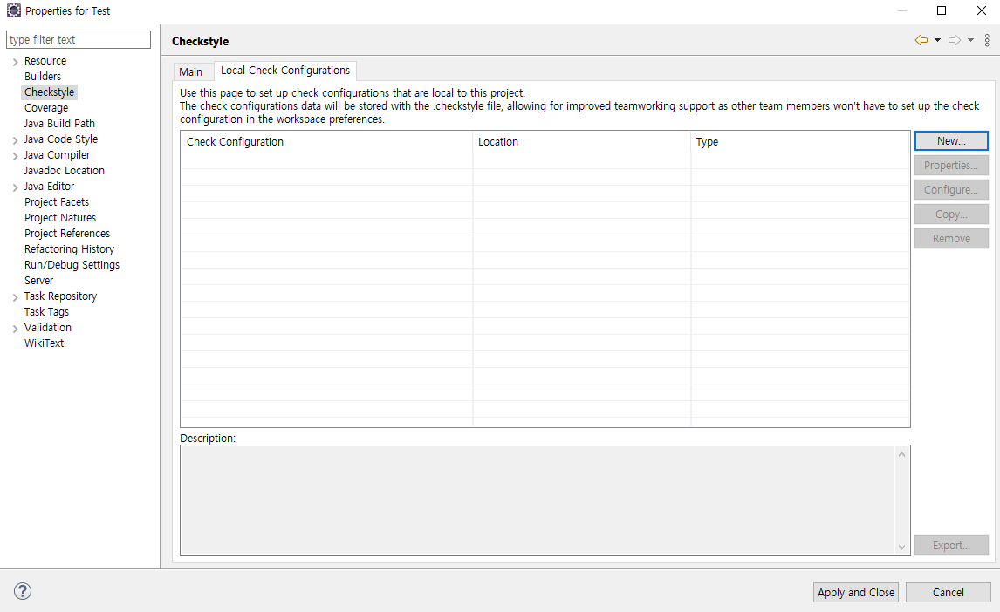
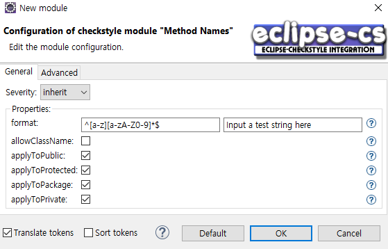

## 소스 코드 정적 분석 툴

### 1. CheckStyle

#### 1) 목적

* 자바 소스 파일을 읽어서 소스 코드 표준에 위반되는 것들을 검색

* 개발자의 취향에 따라 변수명, 메소드명, 작성법 등이 달라 발생하는 문제를 해결하기 위해서 만들어짐

  → 마치 한 사람이 코딩한 것 같은 느낌을 만들어 줌

#### 2) 장점

* 정해진 코딩 규약에 위반되는 것들을 검사해줌
* 직접 코딩 규약을 만들어 사용 가능 

#### 3) 단점

* 실제 버그를 찾을 수 없음

#### 4) 설치 및 설정

① Plug-in

* Help > Install New Software

  

* http://eclipse-cs.sf.net/update/ 주소 추가 후 Checkstyle 플러그인 선택

  

* 프로젝트 우클릭 > Properties > Checkstyle

  

* 화면 혹은 Window > Show View > Other > Checkstyle > Checkstyle violations 창으로 확인 가능

   

  

  

② Gradle

* build.gradle에 ```apply plugin: 'checkstyle'``` 추가

* checkstyle.xml 작성

  * https://github.com/checkstyle/checkstyle/blob/master/src/main/resources/sun_checks.xml

  * https://github.com/checkstyle/checkstyle/blob/master/src/main/resources/google_checks.xml
  * https://github.com/checkstyle/checkstyle/blob/master/config/checkstyle_checks.xml

* build.gradle에 checkstyle 태스크 정의

  ```groovy
  checkstyle {
      ignoreFailures = true // 분석결과 예외가 발생하면 빌드실패 발생시키는 것을 제외
      configFile = file("config/checkstyle/checkstyle.xml") // 작성한 checkstyle 파일 지정
      reportsDir = file("${buildDir}/checkstyle-output") // 리포트 파일이 위치할 디렉토리 지정
  }
   
  checkstyleMain {
      reports {
          xml.destination = file("${checkstyle.reportsDir}/checkstyle-report.xml") // 리포트 파일의 위치 및 파일명 지정
      }
  }
  ```

* `gradlew clean build` 혹은 Gradle Tasks > vertification > check

* 리포트 파일이 위치한 디렉토리의 main.html을 통해 확인 가능

  

#### 5) 커스터마이징

① Plug-in

* 프로젝트 우클릭 > Properties > Checkstyle > Local Check Configurations

  

* 설정 파일 생성

  

  * 설정 파일 타입: 내부 설정 파일 / 외부 설정 파일 import / 원격 설정 파일 import / 다른 프로젝트 설정 파일 import

* 더블 클릭하여 수정

  

  

  

② Gradle

* checkstyle.xml 수정

> GNU Lesser General Public License


### 2. PMD

#### 1) 목적

* 프로그램의 부적절한 부분을 찾아내고 성능을 높이도록 도와줌
* 사용하지 않는 변수, 아무런 처리도 하지 않은 catch block, 불필요한 Object 생성 등을 찾아냄

#### 2) 장점

* 종종 실제 결함을 찾아줌
* 개발자의 나쁜 습관을 알아차릴 수 있음

#### 3) 단점

* 복제된 코드를 찾는 속도가 느림

#### 4) 설치 및 설정

① Plug-in

* Help > Install New SoftWare

  

* https://dl.bintray.com/pmd/pmd-eclipse-plugin/updates/ 주소 추가 후 PMD 플러그인 선택

  

* Window > Preferences > PMD > Rule Configuration

  

* 프로젝트 혹은 파일 우클릭 > PMD > Check Code

  

* Open Perspective > PMD 창에서 Violations Outline 창을 통해 확인 가능

  

  * 클릭 시 해당 소스로 이동

* 규칙의 우선순위를 1단계에서 5단계로 분류하며 값이 낮을 수록 높은 위험을 가짐

  

② Gradle

* build.gradle에 `apply plugin: 'pmd'` 추가

* pmd.xml 작성

* build.gradle에 pmd 태스크 정의

  ```groovy
  pmd {
      toolVersion = "6.23.0" 
      ignoreFailures = true
  	ruleSetFiles = files("config/pmd/pmd.xml")
      reportsDir = file("${buildDir}/pmd-output")
  }
   
  pmdMain {
      reports {
          xml.destination = file("${pmd.reportsDir}/pmd-report.xml")
      }
  }
  ```

  > checkstyle은 toolVersion을 명시하지 않아도 오류가 나지 않는 반면에 pmd는 toolVersion을 명시하지 않으면 오류가 난다(check는 성공하지만 main.html을 보면 오류가 발생해 있음). 정확한 원인은 모르겠지만 아마도 checkstyle은 default 버전이 오류가 안 나는 버전이고, pmd는 default 버전이 오류가 나는 버전이라 그런 거 아닐까 싶다. **확실하진 않음!**

* `gradlew clean build` 혹은 Gradle Tasks > vertification > check

* 리포트 파일이 위치한 디렉터리의 main.html에서 확인 가능

  

#### 5) 커스터마이징

| 속성명                    | 비고                                      |
| ------------------------- | ----------------------------------------- |
| Rule name                 | 수정 불가능                               |
| Rule implementation class | 수정 불가능                               |
| Priority                  | 수정 가능, 정수형으로 1에서 5 범위를 가짐 |
| Message                   | 수정 가능, 문자형                         |
| Description               | 수정 가능, 문자형                         |
| Example                   | 수정 가능, 문자형                         |

① Plug-in

* Window > Preferences > PMD > Rule Configuration의 Rule 탭을 통해 수정

  

② Gradle

* pmd.xml 수정

  ```xml
  <rule name="MyJavaRule"
        language="java"
        message="Violation!"
        class="com.me.MyJavaRule" >
      <description>
          Description
      </description>
      <priority>3</priority>
  </rule>
  ```

#### 6) 참고

* 룰셋을 xml 파일로 export 할 때 체크된 것이 아니라 선택된 것만 export 됨

  

> BSD-style License

> https://isfasiel.tistory.com/tag/PMD 에 PDM에 대해 정리가 잘 되어 있다. 참고하면 좋을 듯. 


### 3. SpotBugs

#### 1) 목적

* 잠재적 버그 찾기

#### 2) 장점

* 실제 결함을 잘 찾아줌
* 찾은 결함이 엉뚱한 결함일 확률이 낮음(정확성이 높음)
* 바이트 코드를 읽으므로 속도가 빠름

#### 3) 단점

* 컴파일된 클래스 파일에서 바이트 코드를 읽어서 사용해야 하므로 빌드 과정이 필수

#### 4) 설치 및 설정

① Plug-in

* Help > Eclipse Marketplace

  

* spotbugs 검색 후 install

  

* 프로젝트 우클릭 > SpotBugs > Find Bugs

  

* Open Perspective > SpotBugs > Bug Explorer 창에서 확인 가능

  

② Gradle

* build.gradle에 플러그인 추가

  ```groovy
  plugins {
      id "com.github.spotbugs" version "4.6.0"
  }
  ```

* build.gradle에 spotbugs 태스크 정의

  ```groovy
  spotbugs {
      ignoreFailures = true
      reportsDir = file("${buildDir}/spotbugs-output")
  }
   
  spotbugsMain {
      reports {
          xml.enabled = true
      }
  }
  ```

* `gradlew clean build` 혹은 Gradle Tasks > vertification > check

* 리포트 파일이 위치한 디렉터리의 main.xml에서 확인 가능

  * spotbugs는 checkstyle과 pmd와 다르게 html과 xml을 동시에 생성해주지 않음

  * html로 확인하고 싶으면 `xml.enabled = true` 대신에 `html.enabled = true` 를 사용해야 함

    

#### 5) 커스터마이징

① Plug-in

* Window > Preference > Java > SpotBugs의 Detector configuration 탭을 통해 수정

  

② Gradle

* 딱히 없는 듯......? 

> Lesser GNU Public License


### 4. SonarQube

#### 1) 목적

* 20개 이상의 프로그래밍 언어에서 버그, 코드 스멜(정상동작은 하나 유지보수 하기 힘든 코드), 보안 취약점을 발견하기 위함

#### 2) 장점

* 프로그램 설치 후 사용 가능한 강력하고 단순한 웹 모니터링 UI 대시보드를 제공
* 테이블과 차트를 이용하여 시간이 지남에 따라 프로젝트가 얼마나 개선되고 있는지를 보여줌
* 코딩 품질 개선을 위한 정보인 소스의 중복이나 복잡도, 유닛 테이스트의 커버리지 및 잠재적인 버그 정보 등을 프로젝트 단위부터 파일 단위까지 제공

#### 3) 단점

* 하나의 작업에 하나의 언어만을 분석할 수 있기 때문에 Java와 JavaScript, Web, XML과 같이 섞여 있는 소스 코드를 한번에 분석할 수 없음

#### 4) 설치 및 설정

* https://www.sonarqube.org/downloads/ 에서 다운로드 후 설치

  

* sonarqube > bin > windows-x86-64 > StarSonar.bat 실행

  

  * `Error: Could not create the Java Virtual Machine.` 에러 발생 시 자바 버전 확인해볼 것
    * java 15에서는 서버 실행을 지원하지 않고 에러에서 언급한 jvm 옵션은 java 14와 함께 제거되었기 때문에 java 11을 사용해야 함

* http://localhost:9000 접속

  * 기본 암호는 admin/admin

* Administration > Marketplace 이동

  

  * 언어마다 분석을 위해 Code Analyzer 설치 필요

    * Java, Korean pack 설치

      

      

#### 5) 유저 관리

* 환경설정(Administration) > 시큐리티(Security) > 사용자(User)

  

#### 6) 그룹 관리

* 환경설정(Administration) > 시큐리티(Security) > 그룹(Group)

  

#### 7) Eclipse와 연동

* 프로젝트 우클릭 > SonarLint > Bind to SonarQube or SonarCloud

  

* SonarQube 선택 후 서버 주소(http://localhost:9000) 입력

  

* Token 혹은 UserName+Password로 접근

  

  * Token의 경우 내 계정 > 보안 탭에서 생성 가능

    

* 연동할 프로젝트 선택

  

* 프로젝트 키 입력

  

  * 프로젝트 키는 SonarQube에서 프로젝트 > Create New Project에서 생성할 때 입력한 프로젝트 키와 동일해야 함

    

* SonarQube의 가이드에 따라 프로젝트 분석 실행

  

  * Window의 경우 위에 나온 명령어 대신 `gradlew.bat sonarqube -Dsonar.projectKey=Test -Dsonar.host.url=http://localhost:9000 -Dsonar.login=[토큰]`을 입력해야 함

* SonarQube에서 결과 확인

  


### 5. SonarLint

* SonarQube 실시간 분석 IDE 플러그인

#### 1) 설치

* Help > Eclipse MarketPlace

  

* SonarLint 검색 후 설치

  

* '~~~' 모양의 밑줄 혹은 Window > Show View > SonarLint > SonarLint Report 창으로 확인 가능

  
  
  

#### 2) 커스터마이징

* Window > Preferences > SonarLint > Rules Configuration에서 수정

  

> Lesser General Public License


## 결론

* CheckStyle은 프로젝트 내에서 자체적으로 규칙을 적용할 때 사용한다. 예를 들어 서비스 클래스들은 ServiceImpl로 끝나고, 이 클래스가 참조하는 인터페이스는 Service로 끝나야 하는 상황일 때라던가.
* PMD는 미사용 변수, 비어 있는 코드 블락과 같이 결함을 유발할 수 있는 코드를 검사할 때 사용한다. 실제 결함보다는 잠재적인 결함을 찾아주는 역할을 한다.
* SpotBugs는 CheckStyle과 PMD와 달리 컴파일된 바이트 코드를 이용해 분석을 하고, 실제 결함을 찾아주는 정확성이 높은 편이다.
* SonarLint는 화면에서 바로바로 확인을 하고 싶을 때 사용하면 좋다. 다른 것들은 직접 실행을 시켜줘야 하지만, SonarLint는 즉각적인 반응이 가능하다.
  * CheckStyle도 즉각적인 반응이 가능하지만 CheckStyle은 코딩 규약에 적합한지만 체크하니까 제외
* SonarQube는 결과를 대시보드를 통해 직관적으로 확인할 수 있다. 