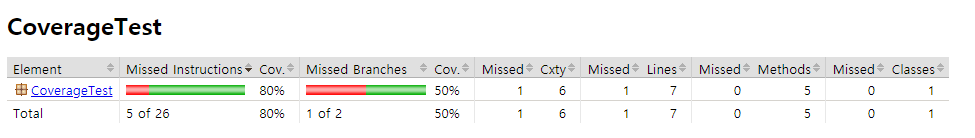
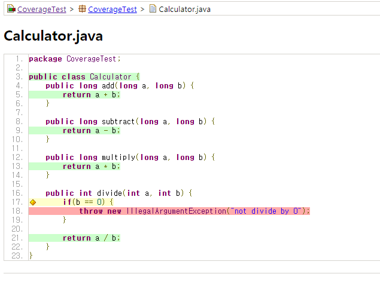
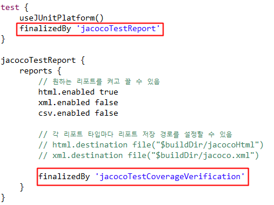
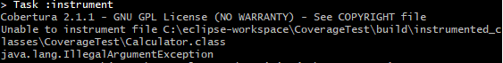
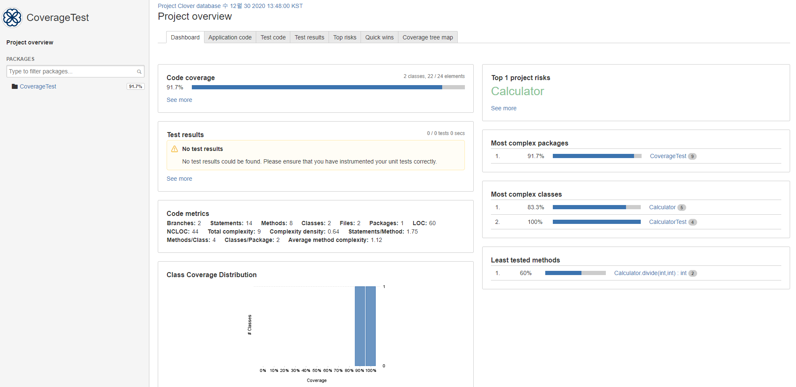
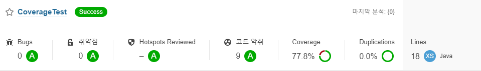
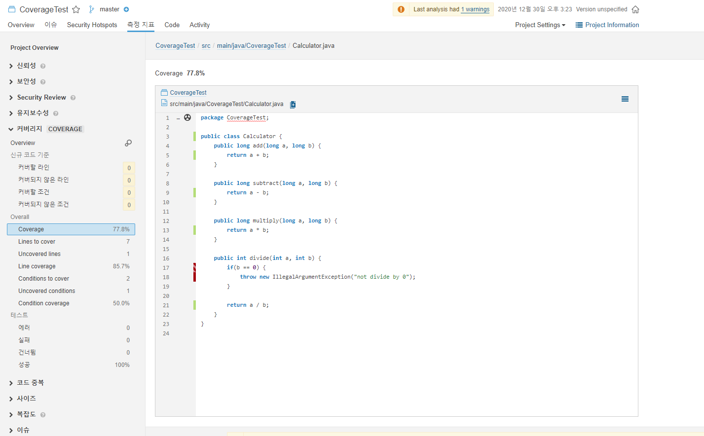

## 개요

### 테스트 커버리지란?

* 시스템, 소프트웨어의 논리적 구조가 Test Suite에 의해 테스트 된 정도
* 테스트의 충분함을 측정

* 테스트 대상의 전체 범위에서 테스트를 수행한 범위
  * 테스트 대상을 얼마만큼 테스트 했나를 정의하는 것
  * 테스트의 정확성을 판단하는 하나의 척도

### 왜 테스트를 작성해야 하는가?

* 코드의 버그를 파악할 수 있음

* 배포 전에 최소한의 안정성을 기대할 수 있음

* 코드 리뷰가 쉬워짐

  * 작성된 코드는 어떻게 사용되는가?
  * 작성된 코드는 어떤 기능인가?
  * 작성된 코드에서 주의해야 할 점은 무엇인가?

  > 위의 세가지를 쉽게 파악할 수 있음


## 테스트 커버리지 툴

### 1. JaCoCo

#### 1) 개념

* 자바 코드 커버리지를 체크하는 데에 사용되는 오픈소스 라이브러리
* 테스트 코드를 돌리고 그 커버리지 결과를 보기 좋도록 html이나 xml, csv 같은 리포트로 생성
* 테스트 결과가 설정한 커버리지 기준을 만족하는지 확인하는 기능도 있음

#### 2) 설정

##### JaCoCo 플러그인 추가

* build.gradle에 플러그인 추가 후 플러그인 설정

  ```groovy
  plugins {
  	id 'jacoco'
  }
  
  jacoco {
  	// JaCoCo 버전
  	toolVersion = '0.8.5'
  
  	// 테스트결과 리포트를 저장할 경로 변경
  	// default는 "${project.reporting.baseDir}/jacoco"
  	reportsDir = file("$buildDir/jacoco")
  }
  ```

##### Gradle task 설정 - 테스트 리포트 저장과 커버리지 체크

* JaCoCo Gradle 플러그인에는 jacocoTestReport와 jacocoTestCoverageVerification task가 있음
  * jacocoTestReport
    * 바이너리 커버리지 결과를 사람이 읽기 좋은 형태의 리포트로 저장
    * 쉽게 눈으로 확인하기 위해 html 파일로 리포트 생성 가능
    * SonarQube 등으로 연동하기 위해 xml, csv 같은 형태로도 리포트 생성 가능
  * jacocoTestCoverageVerification
    * 자신이 원하는 커버리지 기준을 만족하는지 확인해주는 task
    * ex) 브랜치 커버리지를 최소한 80% 이상으로 유지하고 싶다면 이 task에 설정하면 됨

  ```groovy
  jacocoTestReport {
   	reports {
  	    // 원하는 리포트를 켜고 끌 수 있음
  	    html.enabled true
  	    xml.enabled false
  	    csv.enabled false
  
  		// 각 리포트 타입마다 리포트 저장 경로를 설정할 수 있음
  		// html.destination file("$buildDir/jacocoHtml")
  		// xml.destination file("$buildDir/jacoco.xml")
  	}
  }
  
  jacocoTestCoverageVerification {
  	violationRules {
  		rule {
  			element = 'CLASS'
  
  			limit {
  				counter = 'BRANCH'
  				value = 'COVEREDRATIO'
  				minimum = 0.90
  			}
  		}
  	}
  }
  ```

* JaCoCo 플러그인은 자동으로 모든 Test 타입의 task에 JacocoTaskExtension을 추가하고, test task에서 그 설정을 변경할 수 있음

  ```groovy
  test {
  	jacoco {
  		destinationFile = file("$buildDir/jacoco/jacoco.exec")
      }
  }
  ```

  * 위 설정은 커버리지 결과 데이터를 저장할 경로를 변경하는 것임
  * unit test와 integration test 등을 분리할 때 사용하면 유용

  * test task default 값

    ```groovy
    test {
        jacoco {
            enabled = true
            destinationFile = file("$buildDir/jacoco/${name}.exec")
            includes = []
            excludes = []
            excludeClassLoaders = []
            includeNoLocationClasses = false
            sessionId = "<auto-generated value>"
            dumpOnExit = true
            classDumpDir = null
            output = JacocoTaskExtension.Output.FILE
            address = "localhost"
            port = 6300
            jmx = false
        }
    }
    ```

##### 코드 준비와 테스트 실행

* 소스 코드

  ```java
  package CoverageTest;
  
  public class Calculator {
  	public long add(long a, long b) {
  		return a + b;
  	}
  	
  	public long subtract(long a, long b) {
  		return a - b;
  	}
  	
  	public long multiply(long a, long b) {
  		return a * b;
  	}
  	
  	public int divide(int a, int b) {
  		if(b == 0) {
  			throw new IllegalArgumentException("0으로 나눌 수 없습니다.");
  		}
  		
  		return a / b;
  	}
  }
  ```

* 테스트 코드

  ```java
  package CoverageTest;
  
  import static org.junit.jupiter.api.Assertions.assertEquals;
  import org.junit.jupiter.api.Test;
  
  public class CalculatorTest {
  	Calculator calculator = new Calculator();
  	
  	@Test
  	void add_Integer() {
  		long result = calculator.add(2147483647, 1);
  		assertEquals(result, 2147483648L);
  	}
  	
  	@Test
  	void subtract_Integer() {
  		long result = calculator.subtract(5, 100);
  		assertEquals(result, -95L);
  	}
  	
  	@Test
  	void multiply_Integer() {
  		long result = calculator.multiply(5, 100);
  		assertEquals(result, 500);
  	}
  	
  	@Test
  	void divide_Integer() {
  		long result = calculator.divide(100, 5);
  		assertEquals(result, 20);
  	}
  }
  ```

* 실행 명령어

  ```powershell
  gradlew --console verbose test jacocoTestReport jacocoTestCoverageVerification
  ```

  * 브랜치 커버리지가 90%를 넘어야 하지만 50% 밖에 되지 않아 실패

    ```powershell
    > Task :jacocoTestCoverageVerification FAILED
    [ant:jacocoReport] Rule violated for class CoverageTest.Calculator: branches covered ratio is 0.50, but expected minimum is 0.90
    
    FAILURE: Build failed with an exception.
    ```

* 확인 경로: `$buildDir/jacoco/test/html/index.html` 

  

  * 코드 파일

    

    * 초록색: 커버가 된 라인
    * 빨간색: 놓친 부분
    * 노란색: 모든 조건이 아닌 일부만 테스트 된 라인
      * ex) if 문에서 true나 false 중 한 가지 조건만 테스트 한 경우

##### task 순서 지정

* jacoco의 report를 받기 위해서는 test > jacocoTestReport > jacocoTestCoverageVerification 순서대로 task를 실행해야 함

* `finalizedBy`를 이용

  

* 실행 명령어

  ```
  gradlew test
  ```

##### 커버리지 기준 설정

```groovy
jacocoTestCoverageVerification {
	violationRules {
		rule {
            // 'element'가 없으면 프로젝트의 전체 파일을 합친 값을 기준으로 함
            // 위의 리포트에서 'Total'로 표시된 부분
            limit {
                // 'counter'를 지정하지 않으면 default는 'INSTRUCTION'
                // 'value'를 지정하지 않으면 default는 'COVEREDRATIO'
                minimum = 0.30
        	}
    	}

        // 여러 룰을 생성할 수 있음
        rule {
            // 룰을 간단히 켜고 끌 수 있음
            enabled = true

            // 룰을 체크할 단위는 클래스 단위
            element = 'CLASS'

            // 브랜치 커버리지를 최소한 90% 만족시켜야 함
            limit {
                counter = 'BRANCH'
                value = 'COVEREDRATIO'
                minimum = 0.90
            }

            // 라인 커버리지를 최소한 80% 만족시켜야 함
            limit {
                counter = 'LINE'
                value = 'COVEREDRATIO'
                minimum = 0.80
            }

            // 빈 줄을 제외한 코드의 라인수를 최대 200라인으로 제한
            limit {
                counter = 'LINE'
                value = 'TOTALCOUNT'
                maximum = 200
            }
        }
    }
}
```

* 설정 가능한 element(커버리지 체크 기준)
  * BUNDLE(default): 패키지 번들
  * PACKAGE: 패키지
  * CLASS: 클래스
  * SOURCEFILE: 소스파일
  * METHOD: 메소드
* 설정 가능한 counter
  * LINE: 빈 줄을 제외한 실제 코드의 라인 수
  * BRANCH: 조건문 등의 분기 수
  * CLASS: 클래스 수
  * METHOD: 메소드 수
  * INSTRUCTION (default): Java 바이트코드 명령 수
  * COMPLEXITY: 복잡도
* 설정 가능한 value
  * TOTALCOUNT: 전체 개수
  * MISSEDCOUNT: 커버되지 않은 개수
  * COVEREDCOUNT: 커버된 개수
  * MISSEDRATIO: 커버되지 않은 비율(0부터 1 사이의 숫자로, 1이 100%)
  * COVEREDRATIO (default): 커버된 비율(0부터 1 사이의 숫자로, 1이 100%)

##### 테스트에서 제외하기

* QueryDsl을 사용하면 자동으로 생성되는 구현체인 `Q*.class` 같은 파일이나, spring-batch 등의 배치 설정 파일들은 커버리지에 올리지 않아도 됨

* `excludes`로 제외할 클래스명을 지정 가능(와일드카드(* 과 ?)를 사용 ok)

  ```groovy
  jacocoTestCoverageVerification {
      violationRules {
          rule {
              element = 'CLASS'
  
              limit {
                  counter = 'LINE'
                  value = 'TOTALCOUNT'
                  maximum = 8
              }
  
              // 커버리지 체크를 제외할 클래스들
              excludes = [
                  '*.test.*',
                  '*.Kotlin*'
              ]
          }
      }
  }
  ```

  * excludes에는 경로가 아닌 **패키지 +클래스명**을 적어야 함

> 참고
>
> **라인 커버리지**
>
> * 테스트 대상 시스템의 전체 클래스 수
> * 테스트 대상 시스템의 전체 메서드 수
> * 테스트 대상 시스템의 전체 소스 코드 줄 수
>
> 전체 소스 코드 라인 수 대비, 테스트 시나리오가 거쳐 가는 소스 코드의 라인 수를 측정한 것을 라인 커버리지라고 함
>
> **브랜치 커버리지**
>
> if나 switch 같은 분기 조건문에 대해서 테스트가 얼마나 커버하고 있느냐를 나타내는 수치


### 2. Cobertura

#### 1) 개념

* 테스트 코드가 액세스한 코드의 백분율을 계산하는 무료 자바 툴로서 jcoverage에 기반을 둠
* Ant, Maven, Gradle, Command Line에서 실행 가능

#### 2) 설정

##### Cobertura 플러그인 추가

* build.gradle에 플러그인 추가 후 플러그인 설정

  ```groovy
  plugins {
      id "net.saliman.cobertura" version "4.0.0"
  }
  
  cobertura {
  	coverageFormats = ['html', 'xml']
  	coverageReportDir = file("$buildDir/cobertura")
  	coverageCheckBranchRate = 90
  	coverageCheckLineRate = 90
  }
  ```

##### 테스트 실행

* 실행 명령어

  ```
  gradlew cobertura
  ```

* 확인 경로: `$buildDir/cobertura/index.html` 

> 주의사항
>
> * Java 11을 지원하지 않음(https://github.com/cobertura/cobertura/issues/381)
>
>   


### 3. Clover

#### 1) 개념

* Condition 커버리지 측정 가능
* Complexity 분석 가능

#### 2) 설정

##### Clover 플러그인 추가

* build.gradle에 플러그인과 디펜던시 추가 후 플러그인 설정

  ```groovy
  plugins {
      id "com.bmuschko.clover" version "3.0.1"
  }
  
  dependencies {
      clover 'org.openclover:clover:4.4.1'
  }
  
  clover {
  	report {
          html = true
          pdf = true
          xml = true
      }
  }
  ```

##### 테스트 실행

* 실행 명령어

  ```
  gradlew cloverGenerateReport
  ```

* 확인경로: `$buildDir/reports/clover/html/index.html`

  

> 주의사항
>
> * src/test/java에 있는 것을 testcase로 인식하지 않아 No test results가 뜸
> * JUnit 5를 지원하지 않음 
>   * JUnit 5로 실행시 Code coverage는 0%가 뜸


### 4. SonarQube

#### 1) 개념

* 생성된 코드 커버리지 결과를 분석하여 보여줌

#### 2) 설정

> [SonarQube 설치](https://github.com/KMG0908/Study/blob/master/%EA%B0%9C%EC%9D%B8%20%EA%B3%B5%EB%B6%80/%EC%9E%90%EB%B0%94/Static%20Analysis%20Tools.md#4-sonarqube)
>
> [JaCoCo](https://github.com/KMG0908/Study/blob/master/%EA%B0%9C%EC%9D%B8%20%EA%B3%B5%EB%B6%80/%EC%9E%90%EB%B0%94/Test%20Coverage%20Tools.md#2-%EC%84%A4%EC%A0%95)

##### SonarQube 태스크 추가

```groovy
sonarqube { 
	properties { 
		property "sonar.projectKey", "CoverageTest" 
		property "sonar.projectName", "CoverageTest" 
		property "sonar.sources", "src/main/java" 
		property "sonar.tests", "src/test/java" 
		property "sonar.java.binaries", "build/classes/java/main/" 
		property "sonar.jacoco.reportPaths", "build/jacoco/test.exec" 
	} 
}
```

> [property 종류](https://docs.sonarqube.org/latest/analysis/scan/sonarscanner-for-gradle/)

##### 테스트 실행

* jacoco report 생성

  ```
  gradlew jacocoTestReport
  ```

* sonarqube 분석 실행

  ```
  gradlew sonarqube 
  -Dsonar.projectKey=CoverageTest   
  -Dsonar.host.url=http://localhost:9000   
  -Dsonar.login=${Token}
  ```

  > 가독성을 위해 라인을 구분했지만 윈도우에서 실행시 한 줄에 적어야 함

> 주의사항
>
> * SonarQube의 커버리지 기능은 생성된 코드 커버리지 결과를 바탕으로 분석만 진행하는 것이기 때문에 sonarqube 분석을 실행하기 전에 코드 커버리지 report가 존재하고 있어야 함!
> * 그렇지 않을 경우 Coverage가 제대로 반영되지 않아 0.0%로 뜸

* 확인: 프로젝트 화면 혹은 해당 프로젝트 > 측정 지표 > 커버리지

  

  